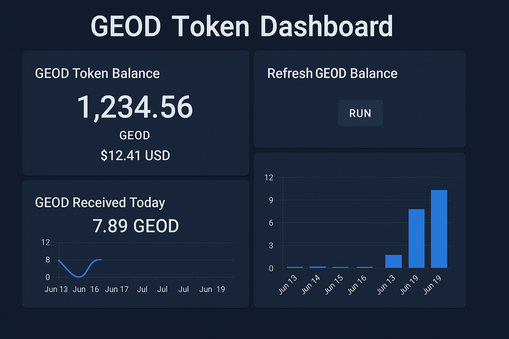

# GEOD Token Dashboard for Home Assistant

---

A simple**Home Assistant dashboard** for tracking your GEOD token stats:

🛰️ GEOD Token Home Assistant Dashboard

A complete YAML-based Home Assistant integration to monitor your GEOD Token balance, USD value, daily received rewards, and price chart — directly from your GEOD-compatible wallet.

---

📦 What's Included

GEOD Token Balance (via Polygonscan API)

USD Price of GEOD (via CoinPaprika API)

Wallet USD Value

GEOD Tokens Received Today

7-Day GEOD Rewards Chart

Manual Refresh Button

 Next Update Time

Sample dashboard screenshot

All configuration in YAML (no custom integration required)

---

Setup Instructions

1. Copy the contents of this repo into your Home Assistant config folder.

2. Edit the secrets.yaml file with your GEOD wallet address and Polygonscan API key:

# secrets.yaml

# Replace the wallet address and API key with your own
geod_token_balance_url: "https://api.polygonscan.com/api?module=account&action=tokenbalance&contractaddress=0xAC0F66379A6d7801D7726d5a943356A172549Adb&address=PASTE_YOUR_WALLET_ADDRESS_HERE&tag=latest&apikey=PASTE_YOUR_API_KEY_HERE"

3. Restart Home Assistant.

4. Add the geod_dashboard.yaml layout or import the view to your dashboard.

❓ Requirements

A Polygonscan API Key

A GEOD-compatible wallet (e.g., Metamask, Trust Wallet)

---

For questions or support, open an issue or fork and contribute 🚀
